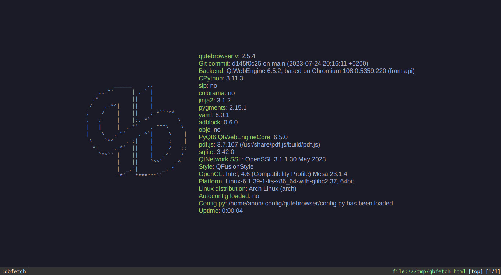

# qbfetch
Display information from qute://version in a "pleasant" way



### Install
```
curl -Ss https://raw.githubusercontent.com/b1337xyz/qbfetch/main/qbfetch.py -o ~/.config/qutebrowser/qbfetch.py
# or
wget -q https://raw.githubusercontent.com/b1337xyz/qbfetch/main/qbfetch.py -O ~/.config/qutebrowser/qbfetch.py
```

```
# ~/.config/qutebrowser/config.py
config.source('qbfetch.py')

# Optional
config.bind('<Ctrl-h>', 'qbfetch')
```
